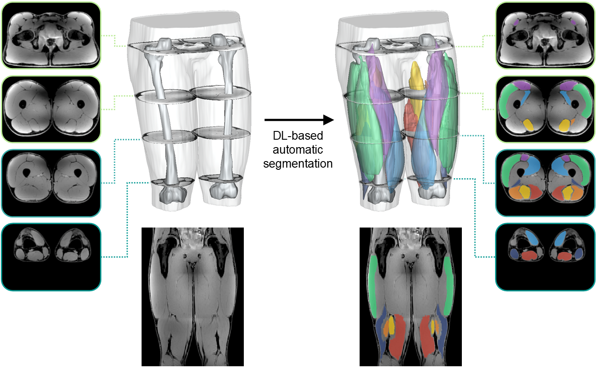

# ThighSegAI – Deep Learning–Based Thigh Muscle Segmentation 

ThighSegAI offers a ready-to-use, fully automatic deep-learning pipeline, built on nnU‑Net, for segmenting thigh muscles from 3D MRI. The pretrained model, developed and validated in the associated publication (DOI\_PLACEHOLDER), was trained on 120 N4‑corrected IDEAL water scans from professional-level football athletes and competitive ACL‑injury subjects, achieving near inter-expert accuracy (DSC ≥ 0.95) with minimal setup. This repository provides researchers and clinicians with the AI model and an example dataset for applying the pretrained model in their own studies.

---

> ⚠️ **DISCLAIMER:** The pretrained nnU-Net model checkpoint is not included yet and will be provided upon manuscript acceptance.

---

<div style="text-align: center;">
    
</div>

## Key Features

* **Zero Configuration**: Off-the-shelf nnU-Net v2 model trained on 120 thigh MR images
* **Clinical Data**: Trained on both professional football athletes and ACL-injury patients, ensuring robustness in athletic and clinical settings
* **Fast & Accurate**: GPU-accelerated inference in under 2 minutes per thigh scan, achieving DSC ≥ 0.95 out of the box
* **Comprehensive ROI**: Segments 7 key muscles per thigh (left & right) for streamlined biomarker extraction
* **Extensible & Open**: Includes example data and fully accessible code for easy customization and integration

---

## Usage

Once everything is set up, you can use the script with the following command structure:

```bash
python seg_ai_thigh.py -i <input_anat_nii> -o <output_mask_nii> -n <path_to_nnunetv2_data>
```

### Arguments:

* `-i`  : Path to the input anatomical NIfTI (e.g. IDEAL water image, N4 corrected).
* `-o`  : Path where the output segmentation NIfTI will be saved.
* `-n` 	: Path to the `nnUNetv2_data/` folder (containing nnUNet_raw, nnUNet_preprocessed, nnUNet_results)

---

## Example

Run on the provided example data in `data/`:

```bash
python src/seg_ai_thigh.py -i data/stackbind_ideal_water_N4.nii.gz -o data/stackbind_ideal_water_muscles_SegDL.nii.gz -n src/nnUNetv2_data
```

The `data/` directory includes:

* `stackbind_ideal_water_N4.nii.gz`: Input anatomical image (IDEAL water image, N4 bias-corrected).
* `stackbind_ideal_water_muscles_SegPropa.nii.gz`: Ground truth segmentation (generated semi‑automatically via [SegPropa](https://gitlab.com/augustin-c-ogier/segpropa)).
* `stackbind_ideal_water_muscles_SegDL.nii.gz`: Auto‑segmentation output one will generate by running the script on the anatomical image.

---

## Dependencies

ThighSegAI is built upon the nnUNetv2 framework (see the original [nnU-Net repository](https://github.com/MIC-DKFZ/nnUNet) for full implementation details). Below are the prerequisites to run our model:

#### 1. Install CUDA

Open a terminal and check if you have CUDA installed:

```bash
nvcc --version
```

You should see output like `Cuda compilation tools, release 11.x`. If not installed, follow [NVIDIA's CUDA installation guide](https://docs.nvidia.com/cuda/cuda-installation-guide-linux/).

#### 2. Install PyTorch

After verifying CUDA, install PyTorch in your environment. Visit [PyTorch Get Started](https://pytorch.org/get-started/locally/) and select the appropriate options for your OS and CUDA version.


#### 3. Python libraries

Install required Python packages:

* **Scipy**: `pip install scipy`
* **MedPy**: `pip install medpy`
* **Numpy**: `pip install numpy`
* **Nibabel**: `pip install nibabel`
* **nnUNetv2**: `pip install nnunetv2`

> **Tip:** We recommend encapsulating all dependencies within a [virtual environment](https://docs.python.org/3/library/venv.html) or a [Conda environment](https://docs.conda.io/projects/conda/en/latest/user-guide/tasks/manage-environments.html).

---

## Important Notes

* **nnUNet data structure required**: The `nnUNetv2_data/` folder must contain the `nnUNet_raw/`, `nnUNet_preprocessed/`, and `nnUNet_results/` subdirectories—this layout is mandatory for nnU-Net's internal operations.

* **Temporary staging**: The script will create timestamped subfolders under `nnUNet_raw/` and `nnUNet_preprocessed/` for staging and automatically clean them up after inference.

* **N4 bias correction**: Input images should be N4-corrected to reduce intensity inhomogeneity. We recommend using [ANTs N4](https://github.com/ANTsX/ANTs/wiki/N4BiasFieldCorrection)).

* **Model training domain**: This model was trained exclusively on IDEAL water images (N4-corrected) from 120 professional-level football athletes and competitive athletes with anterior cruciate ligament injuries. Performance on other image contrasts or populations is not guaranteed. Custom models for different data types can be provided upon reasonable request.

* **Region of interest**: The model segments the following 14 thigh muscles (label indices):

  | Muscle                      | Left | Right |
  | --------------------------- | ---- | ----- |
  | Vastus Lateralis            | 8    | 1     |
  | Vastus Medialis             | 9    | 2     |
  | Rectus Femoris              | 10   | 3     |
  | Biceps Femoris (Short Head) | 11   | 4     |
  | Biceps Femoris (Long Head)  | 12   | 5     |
  | Semitendinosus              | 13   | 6     |
  | Semimembranosus             | 14   | 7     |

* **Post-processing caveat**: The model was designed for bilateral thigh images. For single-thigh data, we recommend mirroring your volume to create a synthetic contralateral thigh, running the model, then removing the mirrored half from the final segmentation. 

---

## Citing this work

If you use this code for your research, please cite the following paper:

1. **Slutsky-Ganesh et al. (2025)** – Streamlining Annotations of MRI Datasets to Build Accurate Deep Learning-based Thigh Muscle Segmentation Models: A Study on Injured and Elite Athlete Populationss. <details><summary>BibTeX entry</summary>
   ```
   @UnderReview{
   }
   ```
</details>

---

## Contributing

We welcome contributions and feedback! If you have any questions or suggestions, please feel free to open an issue on this repository.

---

## License

This work is licensed under the [Creative Commons Attribution-NonCommercial-ShareAlike 4.0 International License (CC BY-NC-SA 4.0)](https://creativecommons.org/licenses/by-nc-sa/4.0/).

You are free to:
- **Share** — copy and redistribute the material in any medium or format
- **Adapt** — remix, transform, and build upon the material

**Under the following terms**:
- **Attribution** — You must give appropriate credit.
- **NonCommercial** — You may not use the material for commercial purposes.
- **ShareAlike** — If you remix or build upon it, you must distribute your contributions under the same license.